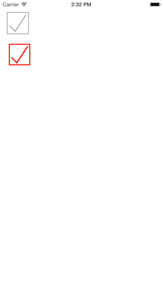

# CheckBox

A checkbox view for iOS implemented in Swift.

## Features

* Animated stroke for check and uncheck
* Variable widths and color

## Installation

Simply add Checkbox.swift in your project. Then either create an instance of Checkbox using code or Interface Builder.

## Usage

### Programmatically

    let cb = Checkbox(frame: CGRect(x: 20, y: 100, width: 50, height: 50))
    cb.borderColor = UIColor.redColor()
    cb.borderWidth = 3
    cb.checkColor = UIColor.redColor()
    cb.checkWidth = 3
    view.addSubview(cb)

### Interface Builder

Just use custom UIView subclass Checkbox on UIView in Interface Builder. Its properties can be changed in IB too.

## License

Copyright (c) 2015 Joe Christopher Paul Amanse. This software is licensed under the [MIT License](./LICENSE.md)

